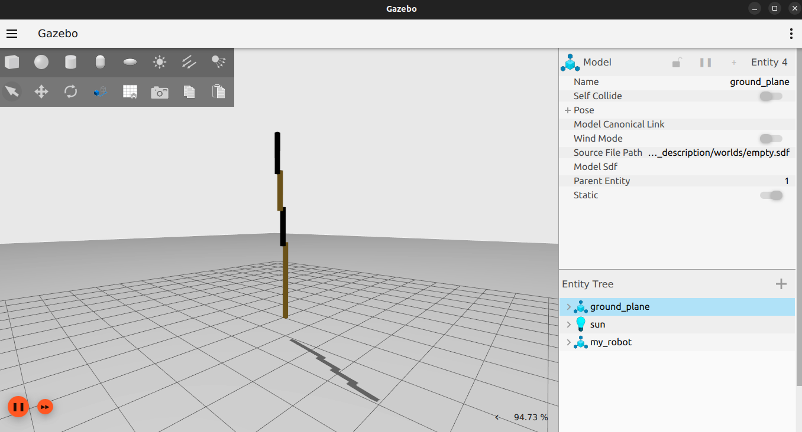
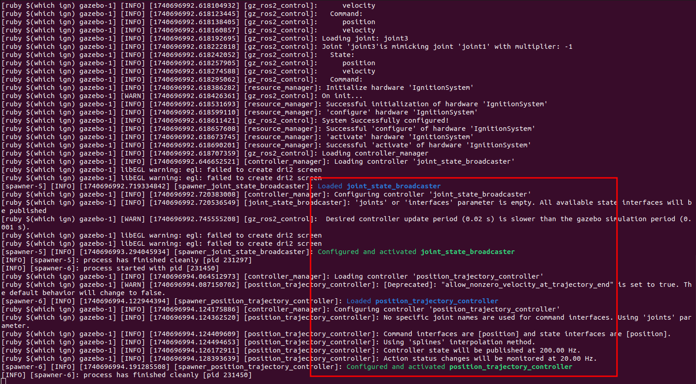
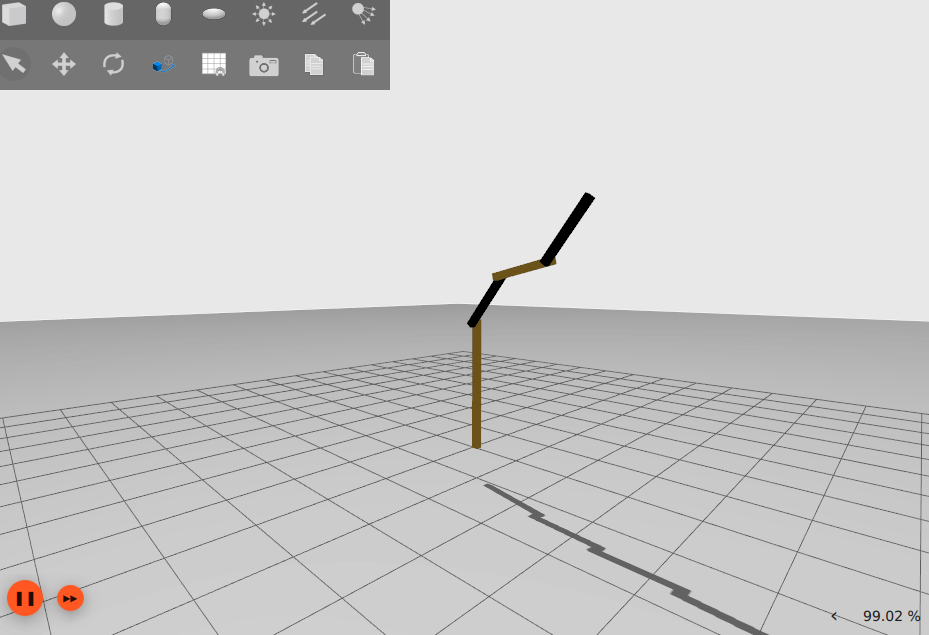

# rrbot

## Try the robot

After compiling the package, you can try the robot with the following commands:
```
source /ros2_ws/install/setup.bash
ros2 launch rrbot_description 5_everything.launch.py
```



These are the expected logs



Use the commmands in `config/pub_joints_trajectory.txt` to see the robot moving

